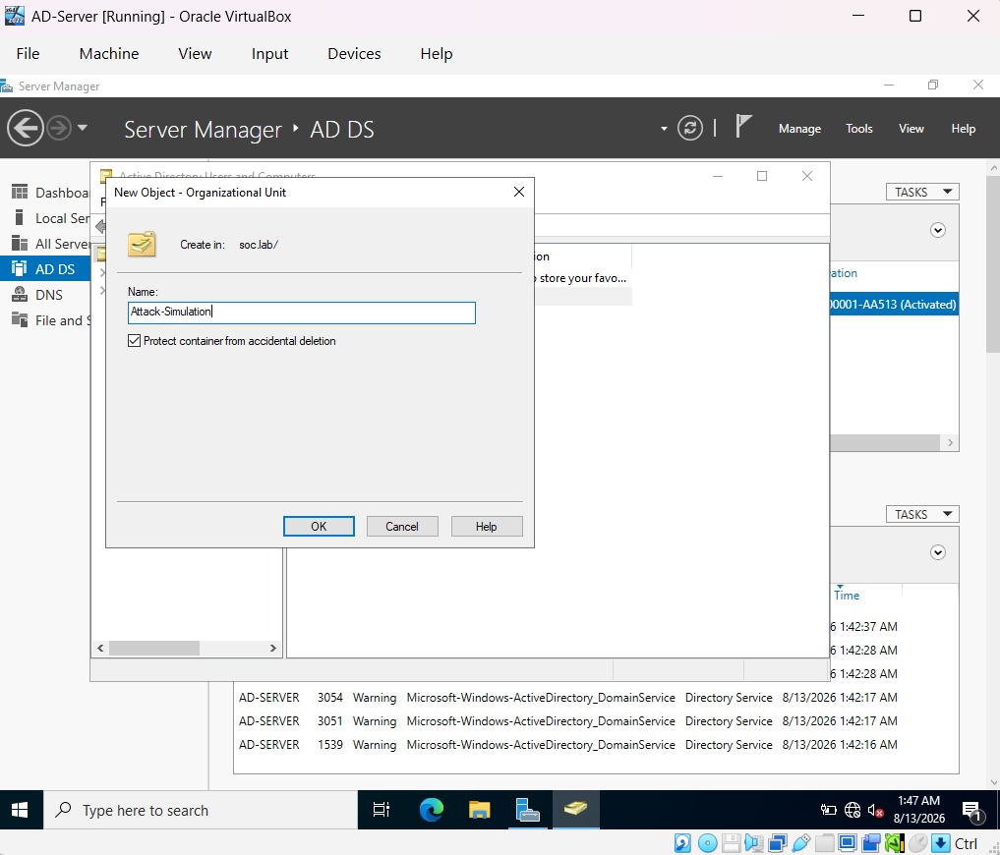
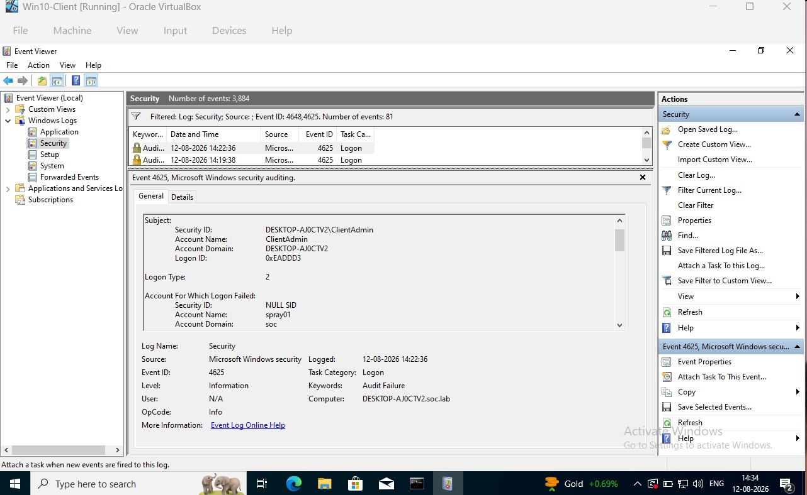
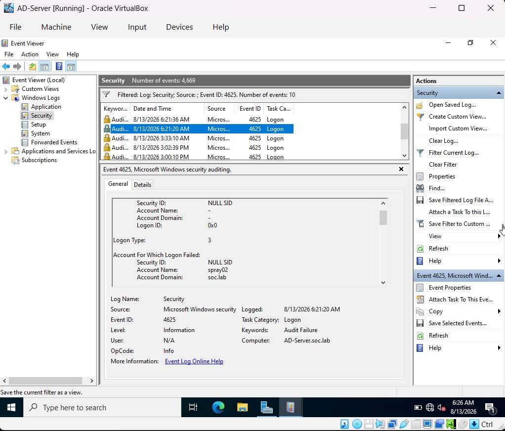
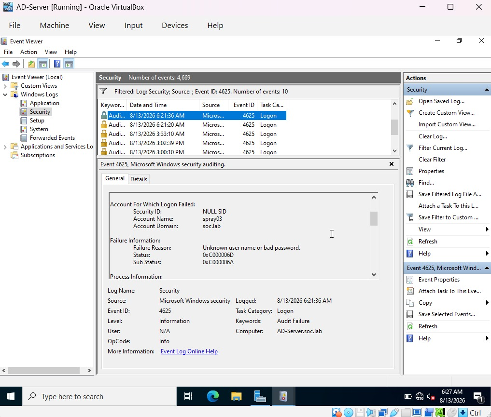
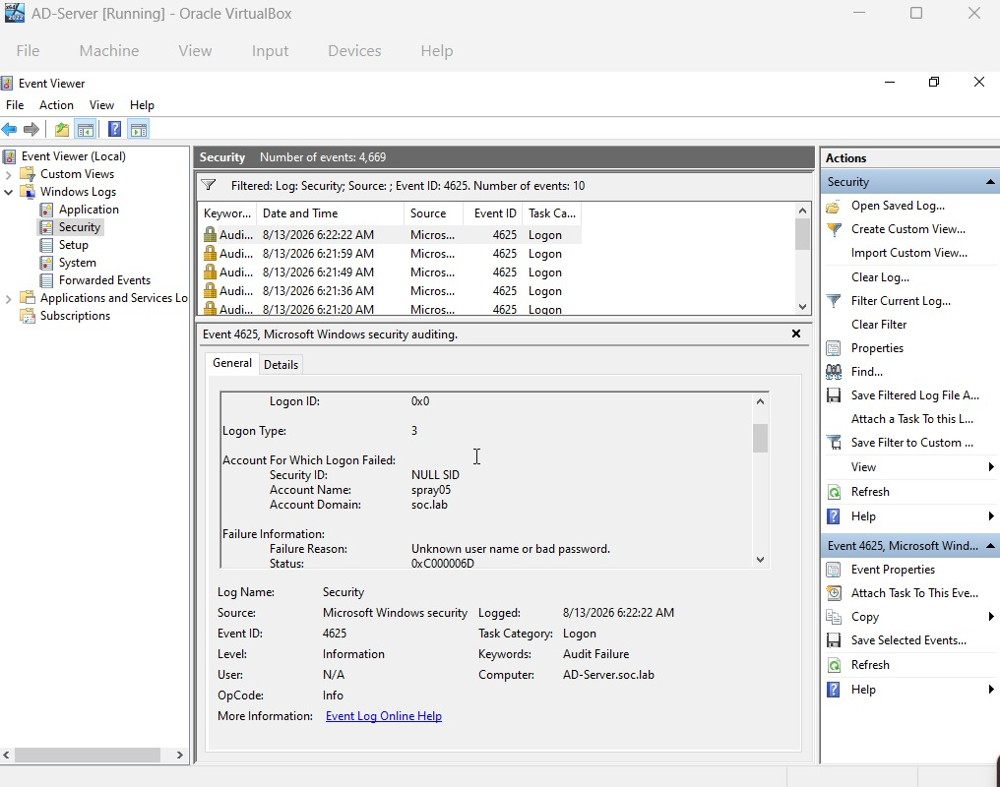
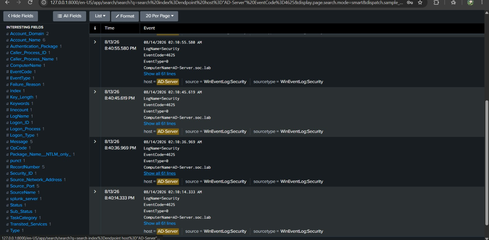

# Active Directory Detection & SIEM Monitoring Lab

A hands-on cybersecurity lab focused on Active Directory security monitoring, Windows authentication telemetry, Splunk SIEM, and detection engineering.

This project demonstrates the workflow of simulating suspicious authentication activity, collecting Windows Security logs, analyzing authentication patterns, developing SPL-based detection logic, and configuring SIEM alerting.

## Project Overview

The lab was built as an isolated security monitoring environment consisting of:

- Windows Server acting as an Active Directory Domain Controller
- Windows 10 client joined to the domain
- Splunk Enterprise for centralized log collection and analysis
- Splunk Universal Forwarder for forwarding Windows event logs
- Controlled authentication attack simulation

The primary detection scenario implemented in this project is password spraying.

## Architecture


### Environment

| Component | Role | IP Address |
|---|---|---|
| Windows Server | Active Directory Domain Controller | `192.168.10.10` |
| Windows 10 | Domain-joined client / attack simulation host | `192.168.10.20` |
| Splunk Enterprise | SIEM / log analysis | `192.168.10.6` |

**Domain:** `soc.lab`

## Detection Workflow

The project follows a basic detection-engineering workflow:

**Attack Simulation → Telemetry Generation → Log Collection → Event Analysis → Detection Logic → SIEM Alert**

## Active Directory Setup

Five controlled domain accounts were created for the authentication simulation:

- `Spray01`
- `Spray02`
- `Spray03`
- `Spray04`
- `Spray05`

The accounts were created specifically for the isolated lab environment.


The accounts were organized under an Attack Simulation organizational unit.



Network connectivity between the Windows 10 client and Active Directory server was also validated.


## Password Spray Simulation

Password spraying is an authentication attack in which one or a small number of passwords are attempted against multiple accounts.

This differs from brute-force authentication, where many passwords are repeatedly attempted against a single account.

The simulation generated controlled failed authentication attempts against the five test accounts.

The resulting Windows Security events were examined individually to understand the telemetry generated by the activity.

### Authentication Telemetry

The failed authentication activity generated **Windows Security Event ID 4625**.

Event ID 4625 represents a failed logon attempt.

A single Event ID 4625 does not automatically indicate password spraying. The detection depends on correlating multiple authentication events and identifying the broader behavioral pattern.

Example events from the simulation:










## Splunk Log Collection

Splunk Universal Forwarder was configured on the Windows systems to forward Windows Security telemetry to Splunk Enterprise.

The collected events were stored in the `endpoint` index.

Initial search:

```spl
index=endpoint host="AD-Server" EventCode=4625
````

This search was used to identify failed authentication events generated on the Active Directory server.



## Splunk Analysis

### Account Analysis

The authentication events were grouped by account to identify which accounts were being targeted.

```spl
index=endpoint host="AD-Server" EventCode=4625
| stats count by Account_Name
```


### Source Analysis

The events were then analyzed by source network address and number of distinct targeted accounts.

```spl
index=endpoint host="AD-Server" EventCode=4625
| stats dc(Account_Name) as unique_accounts count by Source_Network_Address
| sort - unique_accounts
```


This analysis helped identify the password-spray pattern: multiple distinct accounts being targeted from a common source.

## Password Spray Detection

The final detection correlates failed authentication events within a 10-minute time window and counts the number of distinct accounts targeted by the same source.

```spl
index=endpoint host="AD-Server" EventCode=4625
| bin _time span=10m
| stats dc(Account_Name) as unique_accounts values(Account_Name) as accounts count by _time Source_Network_Address
| where unique_accounts >= 3
```

### Detection Logic

The detection:

1. Filters for failed Windows authentication events.
2. Groups events into 10-minute windows.
3. Groups activity by source network address.
4. Counts distinct targeted accounts.
5. Flags activity when three or more distinct accounts are targeted.

The threshold of three accounts within ten minutes was selected specifically for this small lab environment and is not intended as a production-ready threshold.

## SIEM Alerting

A scheduled Splunk alert was configured using the password-spray detection.

**Alert name:**

`Potential Password Spray - Multiple Accounts`

**Description:**

> Detects multiple failed authentication attempts against distinct Active Directory accounts from a single source within a 10-minute window.


The alert was configured to evaluate the detection periodically and trigger when matching activity was found.

## Investigation

The investigation progressed from individual authentication events to a broader behavioral pattern.

The analysis established:

* Multiple failed authentication events
* Multiple distinct domain accounts
* A common source
* Activity occurring within a defined time window

This provided the basis for the password-spray detection and SIEM alert.

## MITRE ATT&CK Mapping

**T1110.003 — Password Spraying**

The simulated behavior corresponds to the Password Spraying sub-technique under Brute Force.

## Key Concepts Demonstrated

* Active Directory fundamentals
* Windows authentication telemetry
* Security Event ID 4625
* SIEM log collection
* Splunk SPL
* Event correlation
* Authentication attack detection
* Password spraying
* Detection engineering
* SIEM alert configuration
* Security investigation workflow


## Ethical Scope

All attack simulations were performed only against systems and accounts created specifically for this lab.

No third-party systems, organizations, or user accounts were targeted.

## Repository Structure

```text
active-directory-detection-lab/
├── README.md
├── architecture/
│   └── lab-architecture.png
├── attacks/
│   └── password-spray.md
├── detections/
│   └── password-spray.spl
└── screenshots/
    ├── ad/
    │   ├── add users.jpeg
    │   ├── network validation.jpeg
    │   ├── ou.jpeg
    │   ├── spray01.jpeg
    │   ├── spray02.jpeg
    │   ├── spray03.jpeg
    │   ├── spray04.jpeg
    │   └── spray05.jpeg
    ├── detection/
    │   └── alert config.jpeg
    └── splunk/
        ├── account analysis.jpeg
        ├── events.jpeg
        └── source analysis.jpeg
```

## Skills & Technologies

**Security:** Active Directory, Windows Security Events, Authentication Monitoring, Detection Engineering

**SIEM:** Splunk Enterprise, SPL, Log Correlation, Alerting

**Systems:** Windows Server, Windows 10, Windows Event Viewer

**Networking:** TCP/IP, DNS, Internal Lab Networking

**Framework:** MITRE ATT&CK


